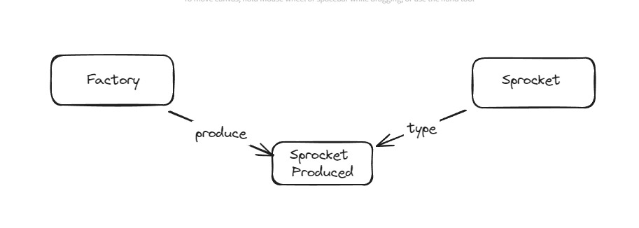
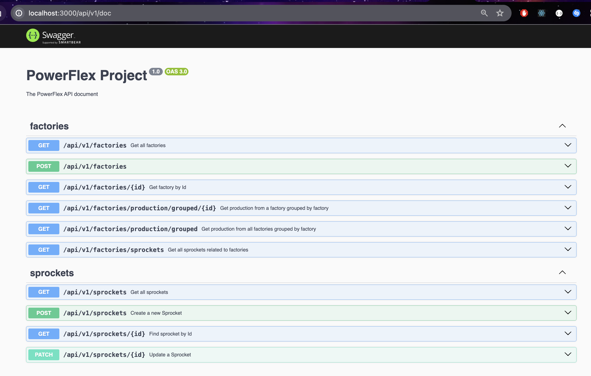

# PowerFlex Backend Challenge

## Description
RESTful api that services requests for sprocket factory data and sprockets

## Prerequisites
- Node.js
- Yarn
- Docker

## Installation
1. Clone the repository.
2. Install dependencies using `yarn install`.

## Usage
- To run the application locally, use `yarn start:dev`.
- To execute test , use `yarn test`.
- To run seeds , use `yarn seed`.
- For production deployment, use Docker. See instructions below.

## Docker Deployment
To deploy the application using Docker Compose, follow these steps:
- execute `docker-compose up -d --build`

## About the project
I choose this relationship

UI for testing endpoints can be found at http://localhost:3000/api/v1/doc

